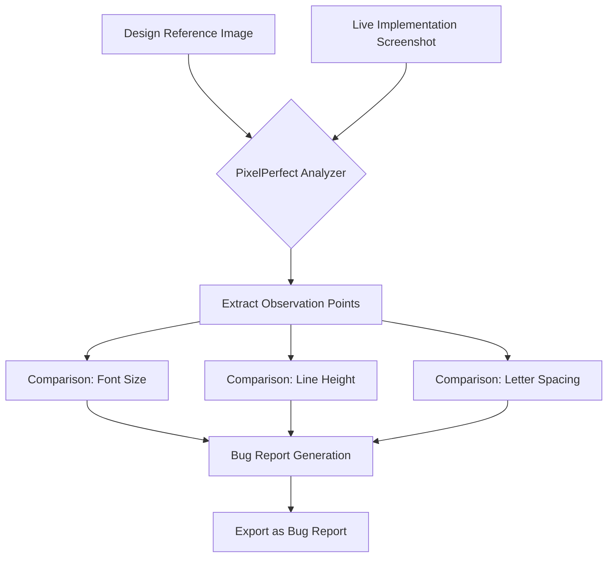

# PixelPerfect | Visual UI Reviewer

PixelPerfect is an AI-powered visual regression analysis tool designed to identify UI discrepancies between Figma designs and live website implementations.

## Features
- **Dual Upload**: Compare design mockups side-by-side with live screenshots.
- **Automated Observation**: Extract typography and layout differences (Font-size, Line-height, Letter-spacing).
- **Bug Reporting**: Generates structured reports ready for development tracking.
- **Premium UI**: Built with a modern glassmorphism aesthetic and dark mode.

## Tech Stack
- **HTML5**: Semantic structure.
- **CSS3**: Premium styling with Vanilla CSS.
- **JavaScript**: Interactive UI and mock analysis logic.

## Getting Started
To run the application locally:
1. Clone the repository.
2. Open `index.html` in your browser or run a local server:
   ```bash
   npx http-server . -p 8080
   ```

## Workflow Diagram



## Created By
- AntiGravity Agentic Assistant
